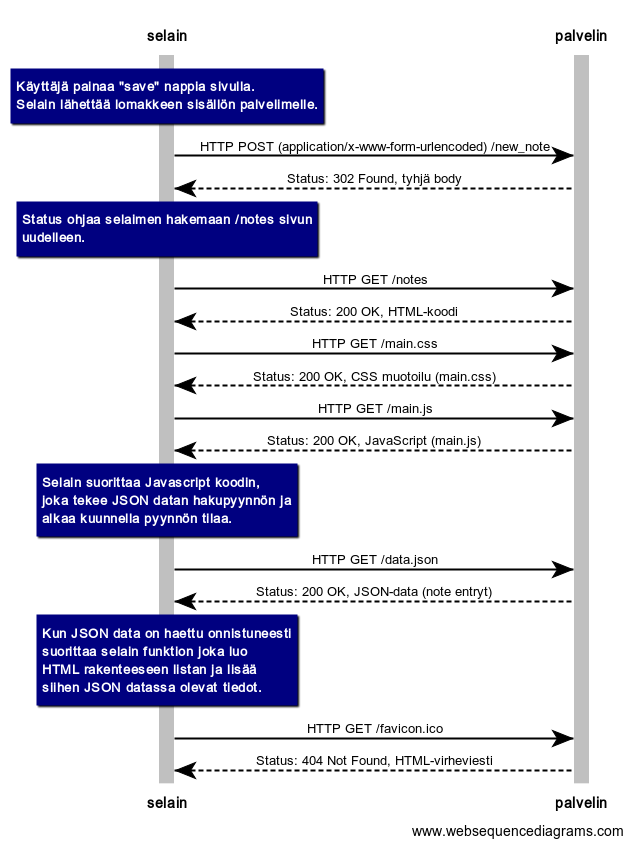

Kaavioiden luonti: https://www.websequencediagrams.com/

## Tehtävä 0.4: uusi muistiinpano



### Koodi
```
note over selain:
Käyttäjä painaa "save" nappia sivulla.
Selain lähettää lomakkeen sisällön palvelimelle.
end note
selain->palvelin: HTTP POST (application/x-www-form-urlencoded) /new_note
palvelin-->selain: Status: 302 Found, tyhjä body
note over selain:
Status ohjaa selaimen hakemaan /notes sivun
uudelleen.
end note:
selain->palvelin: HTTP GET /notes
palvelin-->selain: Status: 200 OK, HTML-koodi
selain->palvelin: HTTP GET /main.css
palvelin-->selain: Status: 200 OK, CSS muotoilu (main.css)
selain->palvelin: HTTP GET /main.js
palvelin-->selain: Status: 200 OK, JavaScript (main.js)
note over selain:
Selain suorittaa Javascript koodin,
joka tekee JSON datan hakupyynnön ja
alkaa kuunnella pyynnön tilaa.
end note
selain->palvelin: HTTP GET /data.json
palvelin-->selain: Status: 200 OK, JSON-data (note entryt)
note over selain:
Kun JSON data on haettu onnistuneesti
suorittaa selain funktion joka luo
HTML rakenteeseen listan ja lisää
siihen JSON datassa olevat tiedot.
end note
selain->palvelin: HTTP GET /favicon.ico
palvelin-->selain: Status: 404 Not Found, HTML-virheviesti
```

