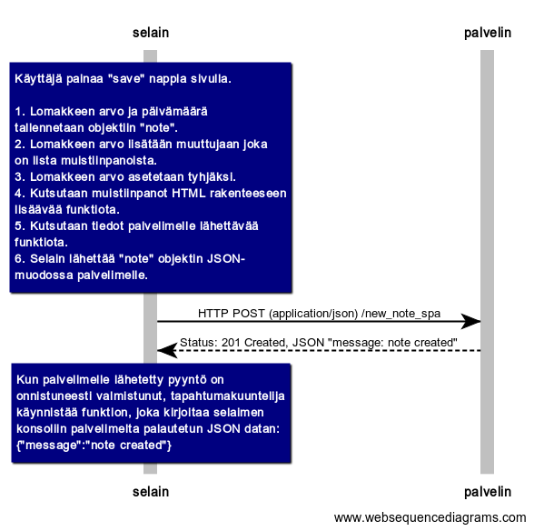

## Tehtävä 0.6: Uusi muistiinpano

### Kuva


### Koodi
```
note over selain:
Käyttäjä painaa "save" nappia sivulla.

1. Lomakkeen arvo ja päivämäärä 
tallennetaan objektiin "note".
2. Lomakkeen arvo lisätään muuttujaan joka
on lista muistiinpanoista. 
3. Lomakkeen arvo asetetaan tyhjäksi.
4. Kutsutaan muistiinpanot HTML rakenteeseen
lisäävää funktiota.
5. Kutsutaan tiedot palvelimelle lähettävää
funktiota.
6. Selain lähettää "note" objektin JSON-
muodossa palvelimelle.
end note
selain->palvelin: HTTP POST (application/json) /new_note_spa
palvelin-->selain: Status: 201 Created, JSON "message: note created"
note over selain:
Kun palvelimelle lähetetty pyyntö on
onnistuneesti valmistunut, tapahtumakuuntelija
käynnistää funktion, joka kirjoitaa selaimen
konsoliin palvelimelta palautetun JSON datan:
{"message":"note created"}
end note
```